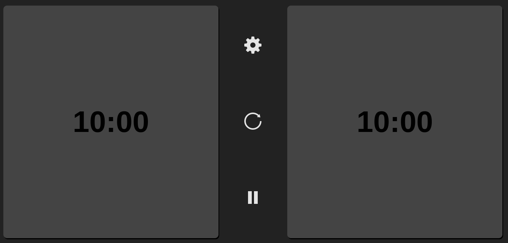
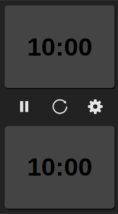
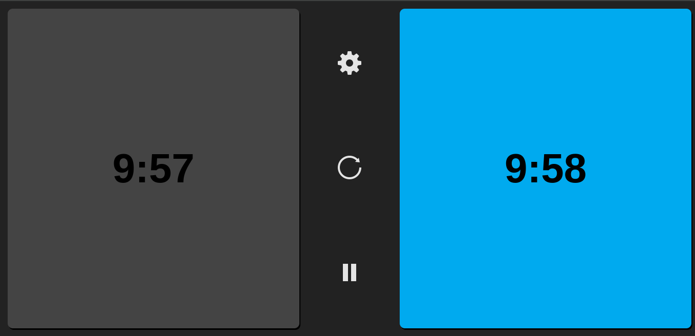
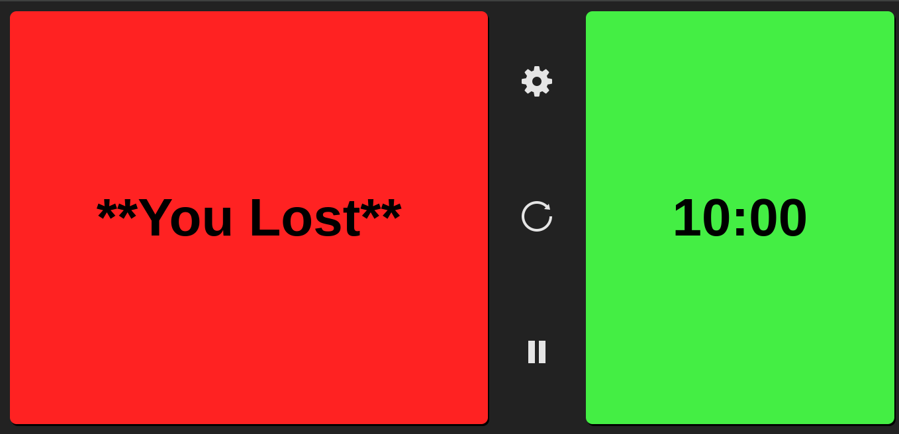

# Chess-Clock

The chess clock I’ve developed is a web application that allows players to manage their time during a chess match. When time runs out, the clock emits a sound alarm to alert the players. Additionally, players can select different time durations, such as 10 minutes, 5 minutes, etc. 

I’ve also incorporated the functionality to add additional time during the game, similar to traditional chess clocks. 

In summary, this project combines web technologies (HTML, CSS, and JavaScript) to create a functional and user-friendly chess clock. 🕰️👑

And this is the result 

- This is what it looks like on a PC with a resolution of 1920x1080:

 

- This is what it looks like on an iPhone SE with a resoution of 375x667:

- This is what it looks like when a clock is counting down time:

 

- This is what it looks like when someone loses:

  

